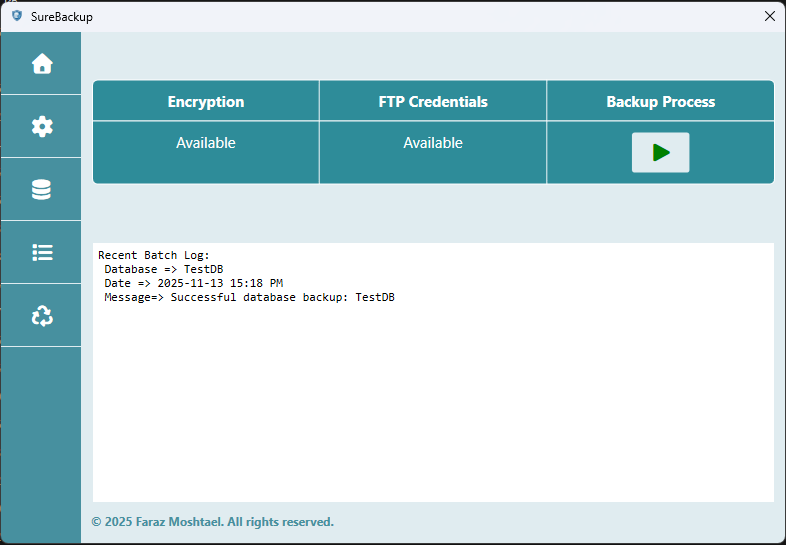

# SureBackup V1.0.0
**SureBackup** is lightweight WPF desktop application which handles local databases backup processing. It can encrypt and also upload the processed backup file to the related FTP host.

## 🚀 Features

- **Automatic Database Backup** - Schedule to run backups by your desired interval.
- **Encryption** - Encryption option for the backup files.
- **FTP Upload** - Uploading backup files option to FTP host.
- **Live logging** - Live visual console logs.

## 🛠️ Tech Stack

- **UI** - WPF - .Net 9
- **Data Access** - EF Core 9 
- **Encryption** - AES - Windows ProtectedData
- **Packaging** - MSIX Installer
- **Networking** - FluentFTP
- **Testing** - XUnit
- **Database** - SQLite
- **Logging** - Serilog
- **Mediator** -  Mediatr

## 🧩 Code Stack

- **Clean Architecture**
- **CQRS Pattern**
- **Repository Pattern**
- **Unit Testing**
- **Integration Testing**
- **DB Migration**
- **Dependency injection Support**

The application is **free** to use. Hope you enjoy and support me.

Next releases with new features are coming.